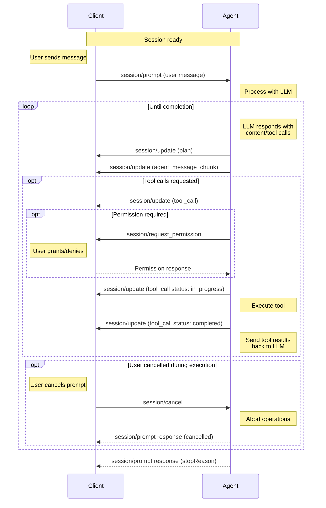

# Prompt Turn

A complete interaction cycle between Client and Agent

A prompt turn represents a complete interaction cycle between Client and Agent, beginning with a user message and continuing until the Agent completes its response. This may include multiple language model exchanges and tool invocations.

> Before sending prompts, Clients **MUST** first complete the initialization phase and session setup.

## The Prompt Turn Lifecycle

The interaction follows a structured sequence:



### 1. User Message

The Client initiates by sending `session/prompt`:

```json
{
  "jsonrpc": "2.0",
  "id": 2,
  "method": "session/prompt",
  "params": {
    "sessionId": "sess_abc123def456",
    "prompt": [
      {
        "type": "text",
        "text": "Can you analyze this code for potential issues?"
      },
      {
        "type": "resource",
        "resource": {
          "uri": "file:///home/user/project/main.py",
          "mimeType": "text/x-python",
          "text": "def process_data(items):\n    for item in items:\n        print(item)"
        }
      }
    ]
  }
}
```

**sessionId** `SessionId` *required*

The ID of the session to send this message to.

**prompt** `ContentBlock[]` *required*

The contents of the user message (text, images, files, etc.). Content types must align with Prompt Capabilities established during initialization.

### 2. Agent Processing

The Agent processes the user's message and sends it to the language model, which may respond with text content, tool calls, or both.

### 3. Agent Reports Output

The Agent reports the model's output via `session/update` notifications, including the plan:

```json
{
  "jsonrpc": "2.0",
  "method": "session/update",
  "params": {
    "sessionId": "sess_abc123def456",
    "update": {
      "sessionUpdate": "plan",
      "entries": [
        {
          "content": "Check for syntax errors",
          "priority": "high",
          "status": "pending"
        },
        {
          "content": "Identify potential type issues",
          "priority": "medium",
          "status": "pending"
        },
        {
          "content": "Review error handling patterns",
          "priority": "medium",
          "status": "pending"
        },
        {
          "content": "Suggest improvements",
          "priority": "low",
          "status": "pending"
        }
      ]
    }
  }
}
```

Text responses from the model are streamed as chunks:

```json
{
  "jsonrpc": "2.0",
  "method": "session/update",
  "params": {
    "sessionId": "sess_abc123def456",
    "update": {
      "sessionUpdate": "agent_message_chunk",
      "content": {
        "type": "text",
        "text": "I'll analyze your code for potential issues. Let me examine it..."
      }
    }
  }
}
```

Tool calls are reported immediately if requested:

```json
{
  "jsonrpc": "2.0",
  "method": "session/update",
  "params": {
    "sessionId": "sess_abc123def456",
    "update": {
      "sessionUpdate": "tool_call",
      "toolCallId": "call_001",
      "title": "Analyzing Python code",
      "kind": "other",
      "status": "pending"
    }
  }
}
```

### 4. Check for Completion

If no pending tool calls exist, the turn ends and the Agent responds with a `StopReason`:

```json
{
  "jsonrpc": "2.0",
  "id": 2,
  "result": {
    "stopReason": "end_turn"
  }
}
```

> Agents **MAY** stop the turn at any point by returning the corresponding StopReason.

### 5. Tool Invocation and Status Reporting

Before execution, the Agent may request permission via `session/request_permission`. Once granted (if required), the Agent invokes the tool and reports an `in_progress` status:

```json
{
  "jsonrpc": "2.0",
  "method": "session/update",
  "params": {
    "sessionId": "sess_abc123def456",
    "update": {
      "sessionUpdate": "tool_call_update",
      "toolCallId": "call_001",
      "status": "in_progress"
    }
  }
}
```

Tools may leverage Client capabilities like file system methods. Upon completion, the Agent sends a final update:

```json
{
  "jsonrpc": "2.0",
  "method": "session/update",
  "params": {
    "sessionId": "sess_abc123def456",
    "update": {
      "sessionUpdate": "tool_call_update",
      "toolCallId": "call_001",
      "status": "completed",
      "content": [
        {
          "type": "content",
          "content": {
            "type": "text",
            "text": "Analysis complete:\n- No syntax errors found\n- Consider adding type hints for better clarity\n- The function could benefit from error handling for empty lists"
          }
        }
      ]
    }
  }
}
```

### 6. Continue Conversation

The Agent sends tool results back to the language model. The cycle repeats from step 2 until the model completes without requesting additional tools or the turn stops.

## Stop Reasons

Agents must specify a `StopReason` when ending a turn:

- **end_turn** — Language model finishes responding without requesting more tools
- **max_tokens** — Maximum token limit is reached
- **max_turn_requests** — Maximum number of model requests in a single turn is exceeded
- **refusal** — Agent refuses to continue
- **cancelled** — Client cancels the turn

## Cancellation

Clients may cancel an ongoing prompt turn by sending `session/cancel`:

```json
{
  "jsonrpc": "2.0",
  "method": "session/cancel",
  "params": {
    "sessionId": "sess_abc123def456"
  }
}
```

> The Client **SHOULD** preemptively mark all non-finished tool calls as cancelled.

> The Client **MUST** respond to all pending permission requests with cancelled outcome.

Upon receiving cancellation, the Agent stops language model requests and tool invocations promptly. After aborting operations, the Agent responds to the original `session/prompt` with the `cancelled` stop reason.

> Agents **MUST** catch these errors and return the semantically meaningful cancelled stop reason.

The Agent may send updates after receiving `session/cancel` but must do so before responding to the prompt request. Clients should accept tool call updates received after sending cancellation.

After a turn completes, the Client may send another `session/prompt` to continue the conversation, building on established context.
