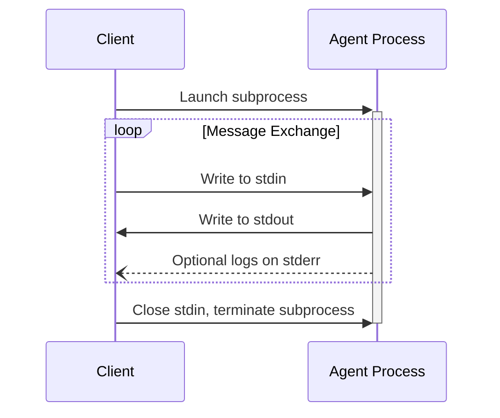

# Transports

Mechanisms enabling agents and clients to exchange information with one another.

ACP utilizes JSON-RPC for message encoding. All JSON-RPC messages **MUST** be UTF-8 encoded.

The protocol currently supports two primary transport mechanisms:

1. **stdio** - communication via standard input/output
2. **Streamable HTTP** - draft proposal under development

Agents and clients **SHOULD** support stdio whenever feasible. Custom transports are also permissible.

## stdio Transport

The stdio transport operates as follows:

- The client initiates the agent as a subprocess
- The agent reads JSON-RPC messages from `stdin` and writes to `stdout`
- Individual messages are delimited by newlines and **MUST NOT** contain embedded newlines
- Agents **MAY** write UTF-8 logging to `stderr`; clients **MAY** capture or ignore these logs
- Agents **MUST NOT** write non-ACP content to `stdout`
- Clients **MUST NOT** write non-ACP content to the agent's `stdin`

## Streamable HTTP

Currently in draft status with ongoing development.

## Custom Transports

Implementations **MAY** create custom transport mechanisms for specialized requirements. Custom transports must maintain JSON-RPC message format integrity and document their connection patterns for interoperability purposes.
